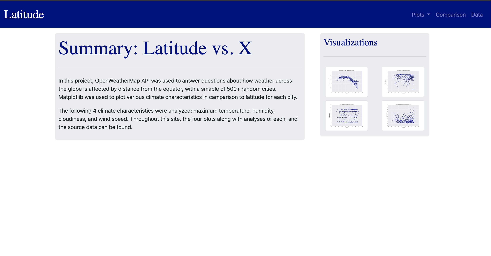

# Climate-Analysis-Dashboard

In this project HTML and CSS/Bootstrap were used to create a visualiztion dashboard, to present plots and data anylses. The dashboard is deployed through github pages and can be viewed at the following link:

https://annaolivia5.github.io/Climate-Analysis-Dashboard/

On the visualization dashboard, analyses of data collected from 500+ cities acorss the globe answers questions about different climate characteristics and latitude (distance from the equator). The following 4 climate characteristics were analyzed: maximum temperature, humidity, cloudiness, and wind speed. The dashboard includes a plot and alysis for each climate characteristic, as well as the full data set used. 

